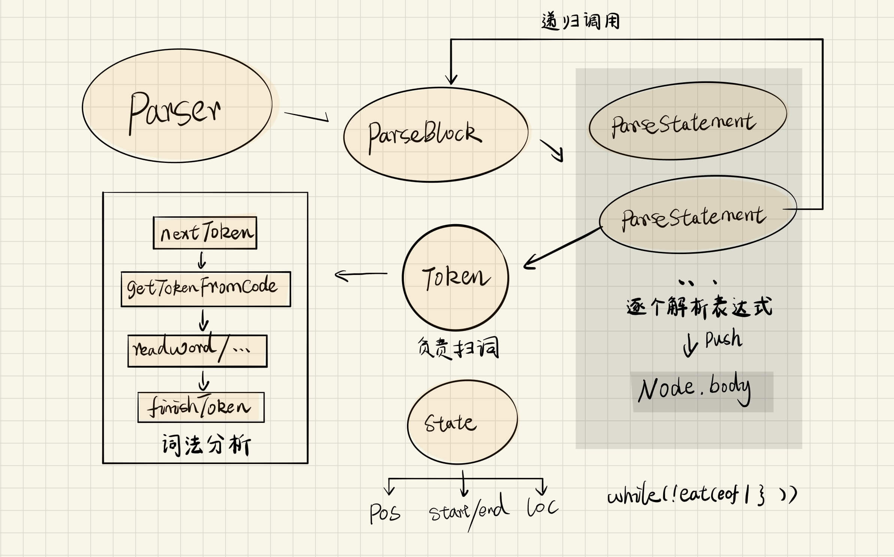

# Babel内部原理系列-AST的构建过程

## Babylon

[babylon](https://github.com/babel/babylon)用于词法与语法分析的JS解析器，后并入babel中，由[babel-parser](https://github.com/babel/babel/tree/master/packages/babel-parser)维护。

## Abstract Syntax Tree

中文意思是抽象语法树，简称`AST`，是源代码语法结构的一种抽象表示（来自维基）。比如下面的简代码： 

```js
function add(a, b) {
	return a + b;
}
add(1, 2);
```

经过编译(词法与语法分析)之后，会生成下面的语法树：

<details>
<summary>展开查看</summary>
<pre><code>
```json
{
  "type": "File",
  "start": 0,
  "end": 37,
  "loc": {
    "start": {
      "line": 1,
      "column": 0
    },
    "end": {
      "line": 3,
      "column": 1
    }
  },
  "program": {
    "type": "Program",
    "start": 0,
    "end": 37,
    "loc": {
      "start": {
        "line": 1,
        "column": 0
      },
      "end": {
        "line": 3,
        "column": 1
      }
    },
    "sourceType": "module",
    "body": [
      {
        "type": "FunctionDeclaration",
        "start": 0,
        "end": 37,
        "loc": {
          "start": {
            "line": 1,
            "column": 0
          },
          "end": {
            "line": 3,
            "column": 1
          }
        },
        "id": {
          "type": "Identifier",
          "start": 9,
          "end": 12,
          "loc": {
            "start": {
              "line": 1,
              "column": 9
            },
            "end": {
              "line": 1,
              "column": 12
            }
          },
          "name": "add"
        },
        "generator": false,
        "expression": false,
        "async": false,
        "params": [
          {
            "type": "Identifier",
            "start": 13,
            "end": 14,
            "loc": {
              "start": {
                "line": 1,
                "column": 13
              },
              "end": {
                "line": 1,
                "column": 14
              }
            },
            "name": "a"
          },
          {
            "type": "Identifier",
            "start": 16,
            "end": 17,
            "loc": {
              "start": {
                "line": 1,
                "column": 16
              },
              "end": {
                "line": 1,
                "column": 17
              }
            },
            "name": "b"
          }
        ],
        "body": {
          "type": "BlockStatement",
          "start": 19,
          "end": 37,
          "loc": {
            "start": {
              "line": 1,
              "column": 19
            },
            "end": {
              "line": 3,
              "column": 1
            }
          },
          "body": [
            {
              "type": "ReturnStatement",
              "start": 22,
              "end": 35,
              "loc": {
                "start": {
                  "line": 2,
                  "column": 1
                },
                "end": {
                  "line": 2,
                  "column": 14
                }
              },
              "argument": {
                "type": "BinaryExpression",
                "start": 29,
                "end": 34,
                "loc": {
                  "start": {
                    "line": 2,
                    "column": 8
                  },
                  "end": {
                    "line": 2,
                    "column": 13
                  }
                },
                "left": {
                  "type": "Identifier",
                  "start": 29,
                  "end": 30,
                  "loc": {
                    "start": {
                      "line": 2,
                      "column": 8
                    },
                    "end": {
                      "line": 2,
                      "column": 9
                    }
                  },
                  "name": "a"
                },
                "operator": "+",
                "right": {
                  "type": "Identifier",
                  "start": 33,
                  "end": 34,
                  "loc": {
                    "start": {
                      "line": 2,
                      "column": 12
                    },
                    "end": {
                      "line": 2,
                      "column": 13
                    }
                  },
                  "name": "b"
                }
              }
            }
          ]
        }
      }
    ]
  },
  "comments": [],
  "tokens": [...<分词信息>]
}
```
</code></pre>
</details>

## 词法分析

基于编译原理的思想，源代码编译的第一步就是词法分析，形象点可以称为扫词：所谓的词法分析就是将源代码解析出最小单位，也就是`Token`，而在`babel-parser`中，负责词法分析工作的是`Tokenizer`，具体一点是`nextToken()`这个函数。比如上面的代码，词法分析阶段会经过以下步骤：

1. 开始解析时，会默认调用`nextToken()`，此时生成一个`Token`，包含`state`信息（比如读词位置）。
2. 扫词：开始时`state.pos`是`0`，在调用`getTokenFromCode()`，根据unicode匹配当前字符，处理各种情况。比如上面例子里的`function`，`f`的unicode编码`102`，因此会执行`readWord()`，会根据当前的位置信息：`state.pos`，while循环下一个字符，直到组词完成，每次循环`pos+1`。
3. 调用`finishToken()`，闭合Token。
4. 之后都是通过`next()`生成Token，遇到空格换行字符则跳过，同时`pos + 1`。

## 语法分析

有了Token之后，就可以进入语法分析阶段了，如果语法分析过程中遇到问题，就会抛出那个我们很熟悉的错误，比如输入`var =`，我们知道变量声明后面必须跟变量名，而`=`明显是不合法的：

<p style="color: red;">
Uncaught SyntaxError: Unexpected token ;
<p>

而在`babel-parser`中，语法分析的入口函数是`parseBlockOrModuleBlockBody`，语法解析会经过以下步骤：


- **块级解析**：从函数命名可以知道这是用于解析块级或模块的，那么如何划分各个块级呢。对于文件而言，边界标识是`eof`（end of file），而普通块级的边界则是`}`，解析到这两个Token时，`eat`就会跳出循环停止解析，在遇到这两个标识前，`babe-parser`根据各个表达式进入`parseStatement()`阶段。
- **parseStatement解析：**在源码开始解析时，默认调用了一次`nextToken()`生成了关键字，然后根据关键字去处理各种`parser***Statement`的情况，举个例子，函数声明：`var a = 1;`，`var`是变量声明的关键字，因此会进入`parseVarStatement()`解析。
- **parseVarStatement解析：**调用`next()`生成下一个token，并进入`parseVar`解析，首先会先检查标识符（Identifier）是否合法，不合法则抛出异常，如果标识符之后跟着`=`，则进行赋值操作`parseMaybeAssign()`，再以`VariableDeclaration`的类型，调用`finishNode()`闭合Token。

以下是在分析源码时画了一个草图：

