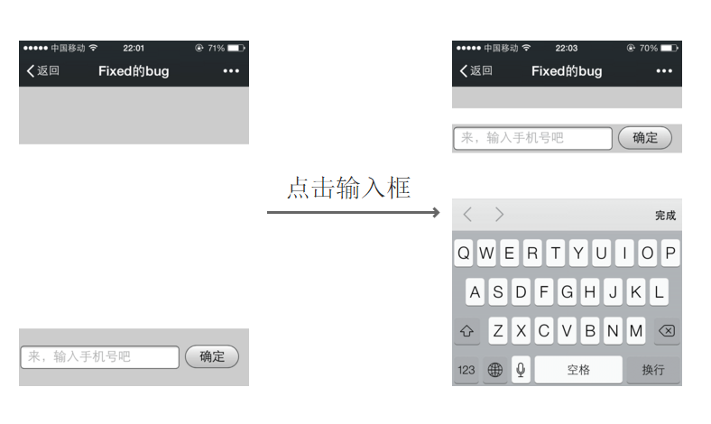

# 关于移动端fixed布局在输入框弹出错位的问题

## 目录

* [前言](#前言)
* [解决思路](#解决思路)

## 前言
最近，在实现移动端css布局的时候，遇到一个坑，即在`position:fixed`布局下，输入框在弹出时，会出现错位的情况。



## 解决思路

个人猜测应该是当页面是滚动时，弹起键盘输入时，页面上的fixed属性会变成absolute。
解决思路：让页面不滚动，所以这里就需要有个容器包裹滚动的内容，使得浏览器不会出现滚动条。代码如下：

```html
<body>
    <header></header>
    <div class="main">
        <div class="container">
            我是内容，我是内容！
            <br> 我是内容，我是内容！
            <br> 我是内容，我是内容！
            <br> 我是内容，我是内容！
            <br> 我是内容，我是内容！
            <br> 我是内容，我是内容！
            <br> 我是内容，我是内容！
            <br> 我是内容，我是内容！
            <br> 我是内容，我是内容！
            <br> 我是内容，我是内容！
            <br> 我是内容，我是内容！
            <br> 我是内容，我是内容！
            <br> 我是内容，我是内容！
            <br> 我是内容，我是内容！
            <br> 我是内容，我是内容！
            <br> 我是内容，我是内容！
            <br> 我是内容，我是内容！
            <br> 我是内容，我是内容！
            <br> 我是内容，我是内容！
            <br> 我是内容，我是内容！
            <br> 我是内容，我是内容！
            <br> 我是内容，我是内容！
            <br> 我是内容，我是内容！
            <br> 我是内容，我是内容！
            <br> 我是内容，我是内容！
            <br> 我是内容，我是内容！
            <br> 我是内容，我是内容！
            <br> 我是内容，我是内容！
            <br> 我是内容，我是内容！
            <br> 我是内容，我是内容！
            <br> 我是内容，我是内容！
            <br> 我是内容，我是内容！
            <br> 我是内容，我是内容！
            <br> 我是内容，我是内容！
            <br> 我是内容，我是内容！
            <br> 我是内容，我是内容！
            <br> 我是内容，我是内容！
            <br> 我是内容，我是内容！
            <br> 我是内容，我是内容！
            <br> 我是内容，我是内容！
            <br> 我是内容，我是内容！
            <br> 我是内容，我是内容！
            <br> 我是内容，我是内容！
            <br> 我是内容，我是内容！
            <br> 我是内容，我是内容！
            <br> 我是内容，我是内容！
            <br> 我是内容，我是内容！
            <br> 我是内容，我是内容！
            <br> 我是内容，我是内容！
            <br> 我是内容，我是内容！
            <br> 我是内容，我是内容！
            <br> 我是内容，我是内容！
            <br> 我是内容，我是内容！
            <br> 我是内容，我是内容！
            <br> 我是内容，我是内容！
            <br> 我是内容，我是内容！
            <br> 我是内容，我是内容！
            <br> 我是内容，我是内容！
            <br> 我是内容，我是内容！
            <br> 我是内容，我是内容！
            <br> 我是内容，我是内容！
            <br> 我是内容，我是内容！
            <br> 我是内容，我是内容！
            <br> 我是内容，我是内容！
            <br> 我是内容，我是内容！
            <br> 我是内容，我是内容！
            <br>
        </div>
    </div>
    <footer>
        <input type="text" placeholder="来，输入手机号吧" />
        <button class="submit">确定</button>
    </footer>
</body>
```

```css
body {
    margin: 0;
    padding: 0px;
}

header {
    position: fixed;
    height: 30px;
    line-height: 30px;
    width: 100%;
    top: 0px;
    background: #ccc;
}

.main {
    position: absolute;
    top: 30px;
    width: 100%;
    bottom: 40px;
    overflow-y: scroll;
    -webkit-overflow-scrolling: touch;
}

.mian .container {
    height: 1200px;
    width: 100%;
    background: #fff;
}

footer {
    position: fixed;
    height: 40px;
    line-height: 40px;
    width: 100%;
    bottom: 0px;
    background: #ccc;
}

footer input,
footer button {
    font-size: 18px;
}
 
```

我们可以看到有一个属性设置`-webkit-overflow-scrolling: touch;`。
这个属性很重要，如果不加这个属性的话，滚动起来会感觉不够流畅。这是-webkit-专有的特性，用来快速滚动和回弹效果。

点击这里查看[demo](/demo/fixed-input/fixed-input.html)