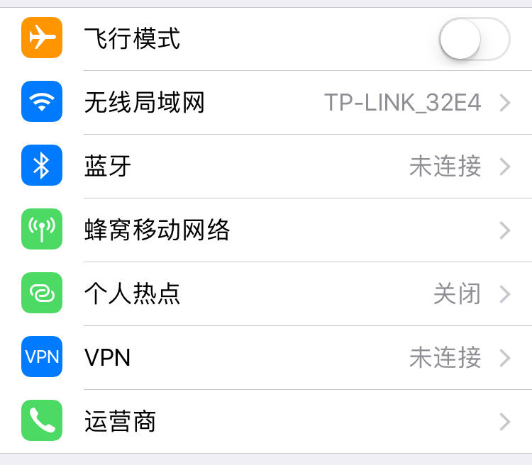

# web移动端适配小结

## 目录
* [什么是PX，DPR](#什么是pxdpr)
    * [物理像素和逻辑像素](#物理像素和逻辑像素)
    * [DPR](#dpr)
* [响应式图片适配方案](#响应式图片适配方案)
* [如何实现1px的线条](#如何实现1px的线条)
    * [1) 0.5px   media queries](#1-05px--media-queries)
    * [2) border-image](#2-border-image)
    * [3) viewport   flexible.js](#3-viewport--flexiblejs)
    * [4) 伪类   transform](#4-伪类--transform)
* [flexible与vw的选择](#flexible与vw的选择)
    * [1) 未对Android设备的viewport进行处理。](#1-未对android设备的viewport进行处理)
    * [2) font-size的单位该如何选择](#2-font-size的单位该如何选择)
    * [3) 拥抱变化，vw是面向未来的选择](#3-拥抱变化vw是面向未来的选择)

## 什么是PX，DPR

在讲web移动端（以下统称移动端）适配前，我们需要理解几个概念，即`PX`，`DPR`，对一些适配策略的理解会有所帮助。

### 物理像素和逻辑像素

**物理像素**可以理解是设备真实分辨率，如iPhone 6s的物理像素是`750px*1335px`，是设备显示屏的一个属性，从设备出厂后这个属性就保持不变。  

**逻辑像素**则是编程概念上的抽象概念，比如CSS的`width:10px`或Canvas的`context.lineWidth = 1`。因此，可能会存在以下关系：  
<!-- more -->

| CSS | 物理（横向） |
| --- | --- |
| 1px | 1px |
| 1px | 2px | 
| 1px | 3px | 
| 1px | ... | 

### DPR
**DPR**又称设备像素比，DPR的计算公式是：  
> DPR = 物理像素(横向) / 逻辑像素

DPR决定了屏幕的高清度，这也是为什么Retina屏幕(DPR大于1)看起来比诺基亚时代的机子清晰太多的原因，如果不拿放大镜，你基本很难看到Retina屏幕的像素点。 

- **1** (iPhone4以下，或一些老旧的安卓/诺基亚手机) 
- **2** (iphone4+，安卓手机)
- **3** (各种iphone plus, iphoneX)
- 1.3，2.6，3.5，5，....

这里需要值得一提的是，我们从[apple官网](https://www.apple.com/cn/iphone-6s/specs/)查看iPhone6s Plus的设置参数，发现分辨率是1080*1920，如果按照上面的公式DPR应该是2.6 = 1080 / 414，这是因为苹果公司用虚拟技术把物理像素放大了，以达到3.0的显示效果。 但是安卓阵营的厂商鱼龙混杂，有些设备存在1.3, 2.6, 3.5等，DPR的值是相当没有规范可言。

## 响应式图片适配方案
Retina屏幕带给了在用户视觉体验上的极大优化，但同时也给开发者产生了一些麻烦，比如一张`375px*200px`的banner图在普通屏幕上，视觉上没有觉得模糊，但如果把这种图片放在Retina屏（DPR=2）的设备，会很明显发现图片`糊掉`了，因为Retina屏实际上需要的是一张`750px*400px`的图片。方案有两种：  

- 简单粗暴，选高清图
- 利用**srcset**作适配


诚然，第一种做法开发是直截了当，但是却给用户带来额外的带宽，比如，`375px*200px`可能就占用几十K，但为了兼容4K电视（DPR为5）的页面，用户可能需要下载几百K甚至上兆的图片，会大大降低页面的体验。作为一个有追求的前端工程师来说，当然愿意花一些开发成本，去给用户带来更好的页面浏览体验，也就是用`srcset`适配高清图片。

**srcset**是img标签的一个属性，该属性可以设置不同DPR下加载不同的图片源，包含两个值，由逗号分隔开的列表，比如下面的例子：

```html


```
上面代码表示，在屏幕的dpr为2的情况下，会选择加载2x.png，在dpr为3的时候，会选择加载3x.png，假设屏幕dpr都不是列举得值时或浏览器不支持srcset属性时，会默认选择加载1x.png，这似乎可以解决不同屏幕密度下加载不同的图片。然而安卓阵营的设备DPR根本没有规范，如果要适配这些设备的话，需要写更多的设置。

为此，w3c又为`srcset`提出了新的标准，`srcset`出现了新的单位`w`，w是一个描述符，指图片源的宽度，比如：

```html

```
当img标签的宽度为200px且DPR=1时，浏览器会选择加载`200px.jpg`，当img标签的宽度为400px时，则会加载`400px.jpg`；当img标签的宽度为200px且DPR=2时，浏览器会智能加载`400px.jpg`。
那么谁来决定img标签的宽度呢，这就是接下来要介绍的新属性**sizes**，sizes是同样接收一个列表，用`,`分隔开各个断点，每个断点的第一个值是类似css的媒体查询，第二个值是图片的宽度。比如: 

```html

```
上面的例子表示，在dpr=1时，浏览器的viewport小于200px时，浏览器会智能选择200px；假设浏览器的viewport为800时，使图片的宽度为viewport的60%，即`480px`，那么浏览器会智能选择`600px.jpg`这张图片。
新的srcset标准，我们不再繁琐的手动设置图片的读取规则，而是我们预先设置规则，让浏览器自动选择合适的图片源。而且大家也可以不必担心浏览器的兼容性，我们可以设置`src`为默认图片，即便用户不兼容`srcset`，也可以正常显示图片。
## 如何实现1px的线条

自从IOS7系统的UI面世后，流行一种极细(1px物理像素)的线条用于作信息分隔符。



从前面介绍的`px`，`dpr`之间的关系得知，如果在css中设置`border:1px solid #000`，渲染到实际设备中时，其实是`2px`的效果，会与系统的UI规范有所差异。为了使web的UI与原生系统的UI保存一致，那么如果实现1px的线条呢，其实方案有很多种，网上也有相关资料。这里我简单总结一下的实现方案，每种方案有利有弊，需要根据实际的场景来选择。

### 1) 0.5px + media queries

2014年的WWDC大会中提出，会在`IOS8`让CSS支持0.5px，这感觉就是为解决`1px线条`而生的，有了这个特性的支持，我们实现就容易多了：

```css
.1px {
  border-bottom: 1px solid #000;
}

@media (-webkit-min-device-pixel-ratio: 2) {
  .1px {
    border-bottom: 0.5px solid #000;
  }
}
```
如果你的web应用只想兼容IOS8+的话，这个方案算是比较简单优雅的，dpr为3的设备渲染出来的效果差异也基本可以忽略。flexible-2.0的版本是通过js检测是否支持0.5px像素单位，如果不支持则用1px，详情查看[flexible](https://github.com/amfe/lib-flexible/blob/2.0/index.js#L32-L43)。

### 2) border-image

假设要实现一条上边框，`border-image`的做法是，用一张 **1px*2px** 的图片，上层1px为透明，下层为线条的实际颜色，如下图（放大的效果）:  


对应的CSS代码：  

```css
.border-top {
  /* 解决pc下chrome，border-image失效的问题 */
  border: 1px solid transparent;
  border-width: 1px 0 0 0;
  border-image: url(../img/border-image.png) 0 0 2 0 stretch;
}
```

假设要实现下上边框，则可以用一张**1px*2px**的图片，上层为1px上边框颜色，中层为透明，下层为下边框颜色，这也算是一个小技巧，详情可以查看[border-image的用法](https://aotu.io/notes/2016/11/02/border-image/index.html)。

border-image实现1px线条有两个比较明显的缺点：  

* 不支持圆角。  
* 修改颜色麻烦，但可以借助[postcss-write-svg](https://github.com/jonathantneal/postcss-write-svg)来实现。

### 3) viewport + flexible.js

viewport是屏幕显示的区域，我们可以通过initial-scale实现屏幕的缩放，这里对viewport不做详细的介绍。另外手淘的flexible.js对IOS设备的viewport进行的适配（安卓为什么不适配，下文再会提到），比如dpr为2的设备，viewport的`initial-scale`为会设置为`0.5`，源码见[lib-flexible](https://github.com/amfe/lib-flexible/blob/master/src/flexible.js#L38-L51)。也就是说原先我们定义的1px的线条，本来在dpr为2的设备，应该会被显示2px的物理像素，但是再通过viewport的0.5缩放，就被显示成1px的物理像素。
因此假设你们的项目如果使用flexible.js，且只需要兼容IOS系列的，那就可以无痛的使用1px:

```css
.border {
  border: 1px solid #000;
}
```
目前手淘和饿了么、美团，均使用了这种方案，当然，这种方案也有致命的缺点：由于flexible.js未对Android的dpr进行适配，故不兼容Android设备。

### 4) 伪类 + transform
在需要实现边框的元素上上，利用伪类`:before`或`:after`代替border，同时用transform的scale缩小一半，伪类使用绝对定位，父类使用相对对位。
底边的实现：

```css
.border-bottom {
  position: relative;
}

.border-bottom:after {
  content: '';
  position: absolute;
  left: 0;
  bottom: 0;
  width: 100%;
  border-bottom: 1px solid #000;
  transform: scaleY(0.5);
  transform-origin: 0 0;
}
```
四条边的实现：

```css
.border {
  position: relative;
  margin-bottom: 20px;
  border: none;
}

.border:after {
  content: '';
  position: absolute;
  top: 0;
  left: 0;
  width: 200%;
  height: 200%;
  border: 1px solid #000;
  box-sizing: border-box;
  transform: scale(0.5);
  transform-origin: 0 0;
}
```
需要对dpr为1的进行兼容，可利用css的`media queries`重置dpr=1的设备样式，也可用js读取`devicePixelRatio`进行适配。

优点是：

* 兼容IOS、Android设备
* 支持圆角

缺点也很明显：

* 代码量过大 
* 部分元素没有伪类，如`input`
* 层级嵌套多

## flexible与vw的选择

flexible的web移动端适配解决方案是手淘研究出来的，于2014年在github上开源出来，并在2015年的双11后，[大漠](https://github.com/airen)写了一篇文章详细介绍了flexible的原理，[传送门](https://github.com/amfe/article/issues/17)。无疑，在移动端适配的痛苦中解脱了出来，短时间内这个方案在国内传遍了，此后也衍生出来许多类flexible的方案。虽然flexible的方案有效解决移动端的适配问题，但是也有一些不足：  

### 1) 未对Android设备的viewport进行处理。

```javascript
if (!dpr && !scale) {
  var isAndroid = win.navigator.appVersion.match(/android/gi);
  var isIPhone = win.navigator.appVersion.match(/iphone/gi);
  var devicePixelRatio = win.devicePixelRatio;
  if (isIPhone) {
    // iOS下，对于2和3的屏，用2倍的方案，其余的用1倍方案
    if (devicePixelRatio >= 3 && (!dpr || dpr >= 3)) {
      dpr = 3;
    } else if (devicePixelRatio >= 2 && (!dpr || dpr >= 2)) {
      dpr = 2;
    } else {
      dpr = 1;
    }
  } else {
    // 其他设备下，仍旧使用1倍的方案
    dpr = 1;
  }
  scale = 1 / dpr;
}
```
手淘给出的回复是，国内还有很多设备对viewport的支持不是很好，在部分设备上，initial-scale的设置会无效，部分webview的屏幕宽度与设备宽度不一致。
### 2) font-size的单位该如何选择  
如果font-size使用了`rem`作为单位，rem换算为像素后，会出现奇数像素，在某些设备上，可能会出现字体发虚的问题，因此flexible给出的方案是，字体不使用rem单位：

```css
div {
  width: 1rem;
  height: 0.4rem;
  font-size: 12px; // 默认写上dpr为1的fontSize
}

[data-dpr="2"] div {
  font-size: 24px;
}

[data-dpr="3"] div {
  font-size: 36px;
}
```
但是在一些slogan的字体上，估计还得使用rem单位，因此这个权衡还得看实际的场景。

### 3) 拥抱变化，vw是面向未来的选择

然而随着移动设备系统版本的升级，Android  4.4，Safari 6开始支持`vw`，让大家有了更多的选择，兼容性可查看 [caniuse](https://caniuse.com/#feat=viewport-units) 。
`vw`是基于viewport的css单位，viewport分为100份，每一份就是1vw，也就是占用可视区域的1%，如果要铺满屏幕就是：

```css
div {
  width: 100vw;
  height: 100vw;
}
```

一切就是这么简单优雅。相信现在前端圈内，已经逐步放弃flexible的方案了，为此大漠写了一篇关于[再谈移动端适配方案](https://www.w3cplus.com/mobile/vw-layout-in-vue.html)的文章。笔者也认为，大家应该积极拥抱浏览器原生的特性，并推进这个方案的快速发展。