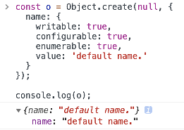
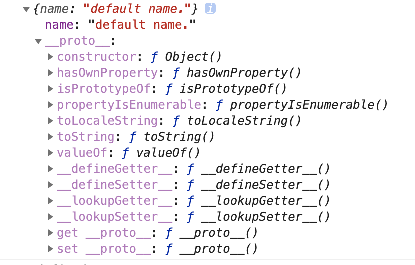

# Object.create的介绍

> 思考：该方法可以创建一个对象，但为什么不直接使用`{}`呢？

## 使用

```javascript
Object.create(proto, [propertiesObject]);
```

- proto是新创建对象的原型对象
- propertiesObject是可选的，是要添加到新创建对象的可枚举属性（即其自身定义的属性，而不是其原型链上的枚举属性）

比如以下例子：

```
const o = Object.create(null, {
  name: {
    writable: true,
    configurable: true,
    enumerable: true,
    value: 'default name.'
  }
});
```

再使用`{}`创建对象x：

```javascript
const o = {
  name: 'default name.',
};
```

## 区别

这两者有什么区别呢？用chrome控制台查看以下结果：





可以看出，用`{}`创建的对象包含了`__proto__`属性，而用`Object.create`创建的并没有包含该属性，所以用这种方式创建的对象会非常干净，没有包含原型链上的方法，一般可以做map使用。