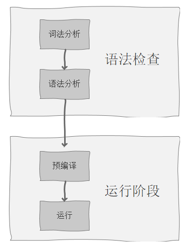
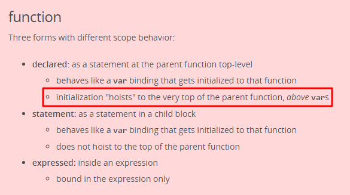

# 函数作用域和变量声明提升

## 目录

* [前言](#前言)
* [变量声明](#变量声明)
* [函数作用域和声明提前](#函数作用域和声明提前)
* [答案](#答案)
* [参考资料](#参考资料)

## 前言

在日常开发中，有时候会遇到一些比较怪异的问题，甚至会骂这是什么破语言啊。这次我要讲的正是怪异JS问题中的冰山一角：**函数作用域以及声明提前**。其实如果理解了它的运行机制，问题也不算是怪异了。先试试下面的题目，如果都答对了（答案在底部），那这篇文章就不需要继续看下去了。<!-- more -->  

**题目1**：

```javascript
a();
function a() {
  console.log(1);
}
a();
function a() {
  console.log(2);
}
a();
var a = function () {
  console.log(3);
};
a();
```

**题目2**：

```javascript
var scope = "global";
function f() {
  console.log(scope);
  var scope = "local";
  console.log(scope);
}
```

以上的题目先不做讲解，我们先来理解一下几个概念：**变量声明**、**函数作用域**和**声明提前**。

## 变量声明

我们知道，javascript是一门解释型语言，执行一段javascript代码会经过下面的过程。

;

在javascript的标准规范里，在使用一个变量之前应该需要经过声明（虽然在非严格模式下，未声明的变量会被当前全局变量使用，但是从代码可读性和维护性上来说，推荐变量使用前声明的方式），就是我们常写的`var`。比如:

```javascript
var a,b,c;
```

因为上面的变量`a`,`b`,`c`并没有给它们赋值，因此他们的值都是`undefined`。

注意：在同一作用域里，重复声明的变量，会被当作普通的赋值操作。

## 函数作用域和声明提前

javascript并没有类似C语言那样的块级作用域，因此，这也是常常给开发者带来的困惑，比如下面的例子:

```javascript
for (var i = 0; i < 10; i++) {
  //dosometing(i)
}
console.log(i);//10
```

你可能会觉得输出的`i`应该是`undefined`，其实不对，变量`i`依然是可以访问的。所以这样看来，javascript确实不存在块级作用域（不过也有例外，在新的JS规范里，用`let`定义的变量是支持块级作用域的，这里不做讨论），取而代之的是**函数作用域**，而且也是唯一拥有自身作用域的结构。  

函数作用域是指在函数体内声明的所有变量都是始终可见的，而且有意思的是，甚至在变量声明之前就已经可以允许访问，这种特性被称作**声明提前(hoisting)**，函数声明提前的意思是，在函数体内所有的变量（不包括赋值操作），都会被提前到函数体的顶端。比如下面的例子：

```javascript
function a() {
  console.log(b);//undefined，但不会报错
  var b = 1;
}
```

其实在javascript的预编译阶段里，会扫描整个a函数的代码，然后把变量b提前到函数的顶端，并赋值为`undefined`，所以上面的代码相当于: 

```javascript
function a() {
  var b;
  console.log(b);
  b = 1;
}
```

同样的，假设b为函数时，也会被提前到函数顶端，如：

```javascript
function a(){
    b();//hello b
    c();//Error,c is not a function
    function b(){
        console.log("hello b");
    }
    var c = function(){
        console.log("hello c");
    }
}
```

上面的例子也是我们经常纠结的地方，为什么b能调用，而c调用不了呢。
还有一种特殊情况，假设函数作用域内，变量名和函数名重复的情况下，到底那个优先呢，不妨验证下：

```javascript
function a() {
  console.log(b);//b函数的代码
  function b() {

  }
  var b = 1;
}
```

是的，函数声明提前比变量声明的优先级更高。可以查阅[javasript MDN](https://developer.mozilla.org/en-US/docs/Archive/Web/Scope_Cheatsheet)。

;

看到这里，我想前面那两道题，你应该可以很轻松的知道答案了。 

## 答案

**题目1答案**：2,2,2,3  
**题目2答案**：undefined,local 

## 参考资料
* 《javascript高级程序设计》
* 《javascript权威指南》
* [javascript MDN](https://developer.mozilla.org/en-US/docs/Archive/Web/Scope_Cheatsheet)