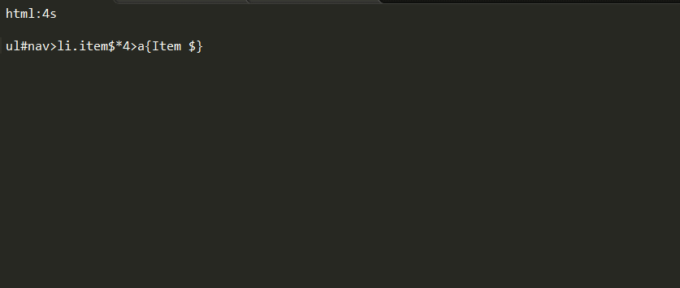
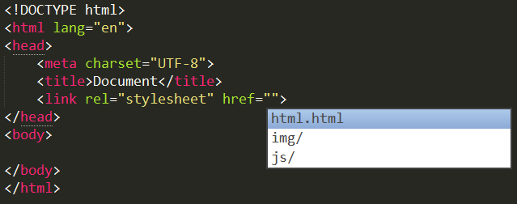

# 分享一些实用的sublime插件

## 目录

* [前言](#前言)
* [插件](#插件)
    * [packge control (包管理)](#packge-control-包管理)
    * [Emmet](#emmet)
    * [AutoFileName](#autofilename)
    * [HTML-CSS-JS Prettify](#html-css-js-prettify)
    * [SublimeLinter](#sublimelinter)
    * [快速选择带有横线(连接符)的类名或ID名（非插件）](#快速选择带有横线连接符的类名或id名非插件)


## 前言

作为一名前端开发者，开发工具直接影响工作的效率。选择一款好的编辑器很重要，在用过N多编辑器后，发现只有sublime能称得上神器，简洁，界面相当友好，快速，几乎是秒开。当然很多人会不赞同，我只是站在前端开发者的角度去评价。废话不多说了，分享几款插件给大家，让sublime如虎添翼！

## 插件

### packge control (包管理)

要使用sublime丰富的插件的话，就必须先安装这个包管理。
安装方式有两种：

* 直接复制这一段到控制台（Ctrl+~）

```
import urllib2,os; pf='Package Control.sublime-package'; ipp=sublime.installed_packages_path(); os.makedirs(ipp) if not os.path.exists(ipp) else None; urllib2.install_opener(urllib2.build_opener(urllib2.ProxyHandler())); open(os.path.join(ipp,pf),'wb').write(urllib2.urlopen('http://sublime.wbond.net/'+pf.replace(' ','%20')).read()); print 'Please restart Sublime Text to finish installation'
```

* 下载[Package Control](http://pan.baidu.com/s/1vvaDC)插件包到插件目录，插件目录在菜单中打开Preference–Browse Packages，没有的话，自己新建一个。  

### Emmet

功能：编码快捷键，前端必备神器之一。
备注：如果熟悉了Emmet的快捷语法，足以让你多出时间去喝杯咖啡了，如果不熟悉也没关系，去[Emmet语法](http://docs.emmet.io/cheat-sheet/)看看，慢慢就熟悉了。



### AutoFileName

功能：快速补全文件路径
备注：如果你早以习惯IDE的快捷补全文件路径，那么这个插件同样不能少。



### HTML-CSS-JS Prettify

功能：美化前端代码，处女座的童鞋必备神器。
备注：如果你不想让接手你代码的人打死你，那么就用这个插件的，哪怕你不是处女座。


### SublimeLinter

功能：前端编码利器，刚开始用的时候，相信你会抓狂，用于高亮提示用户编写的代码中存在的不规范和错误的写法。
备注：用这个插件能及时帮我们纠正代码的错误，并培养我们良好的编码习惯和风格，当然如果觉得不爽它定的规范，你通过设置取消一些代码检测规则，此插件需要安装nodejs环境。


### 快速选择带有横线(连接符)的类名或ID名（非插件）

功能：在CSS编码的时候，我们习惯用横线连接来定义一个类名或ID名，而sublime默认不支持选择选择带有横线连接符的。我们可以自己设置一下，打开`Setting-User`，在最后一行加入下面的代码，保存即可！
```
"word_separators": "./\\()\"':,.;<>~!@#$%^&*|+=[]{}`~?"
```
