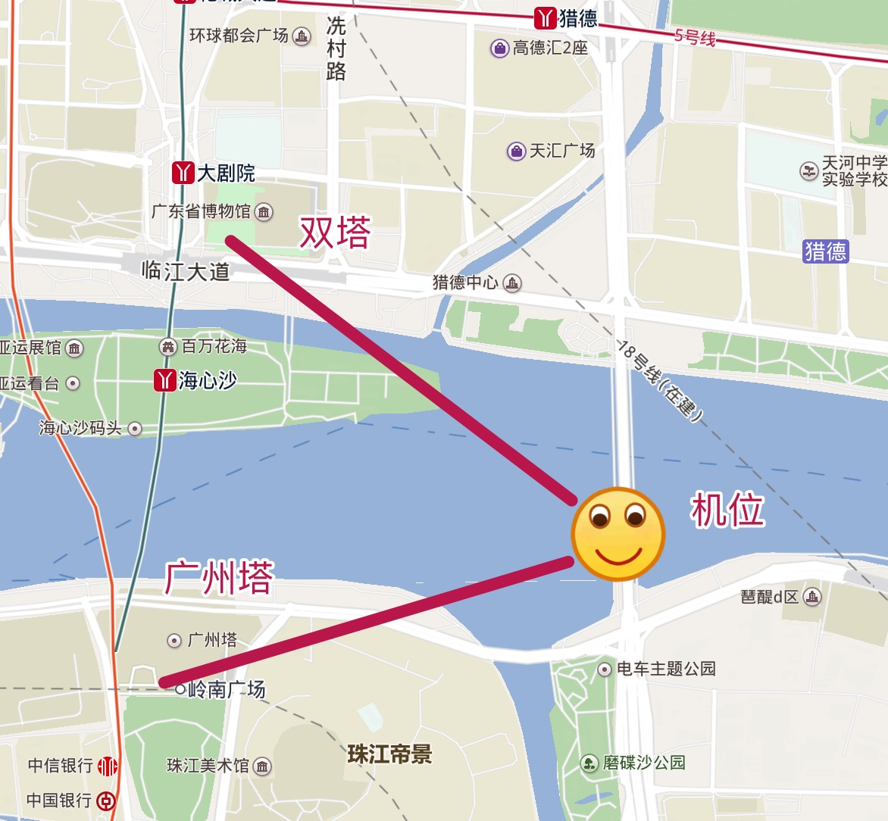
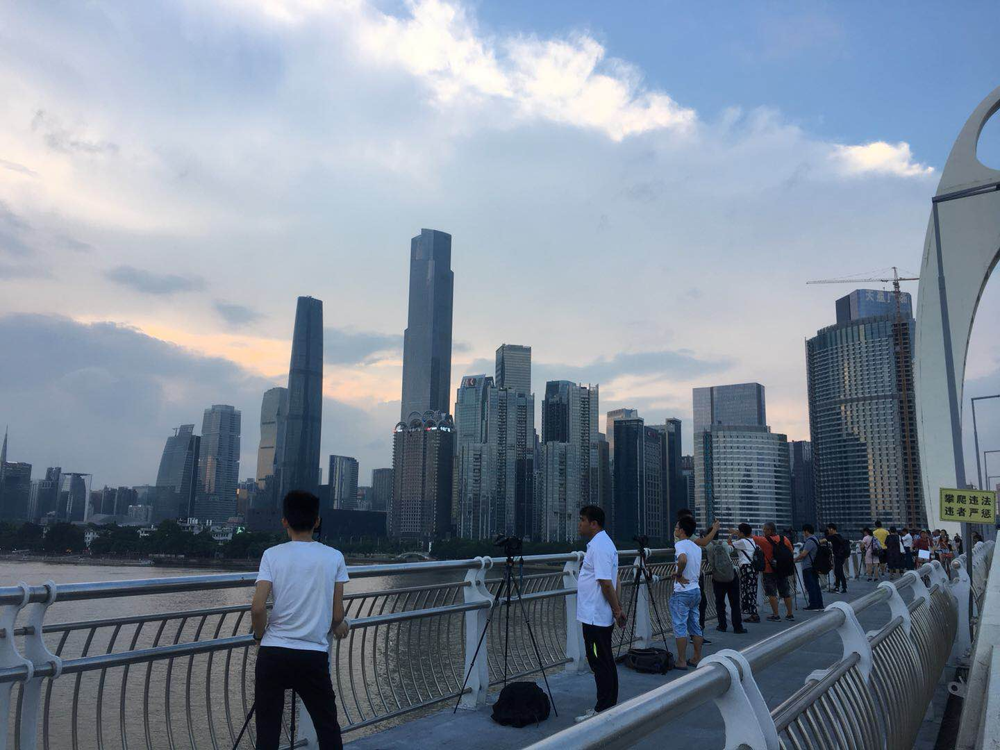
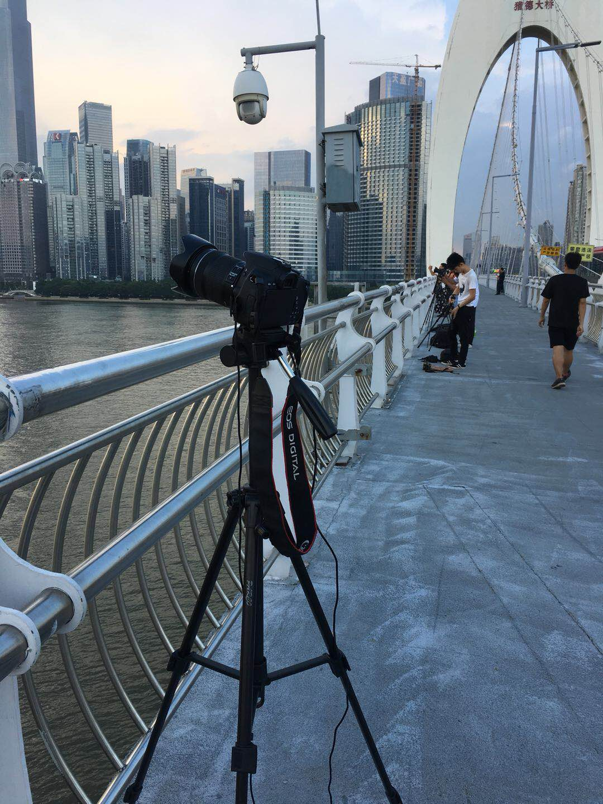
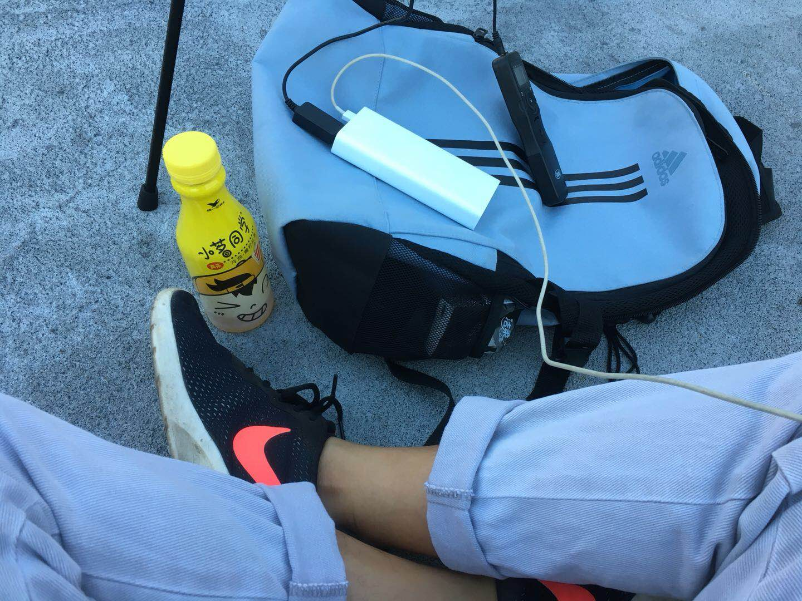
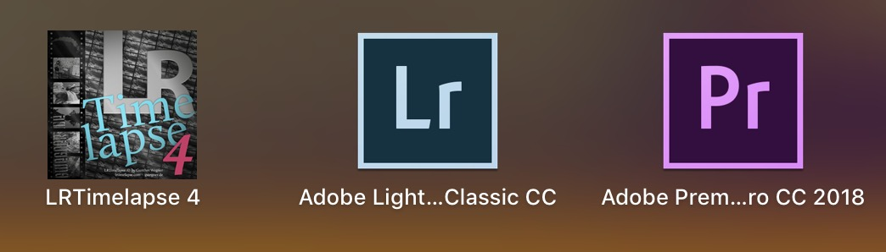
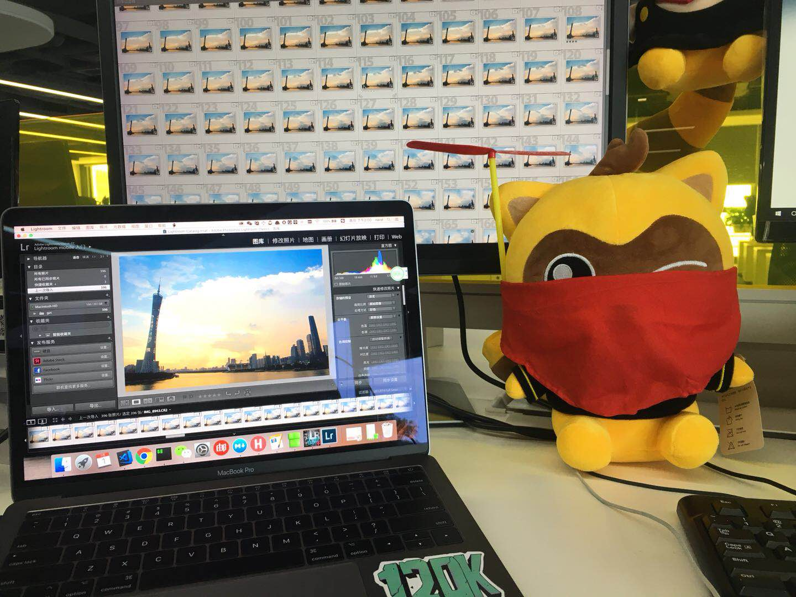
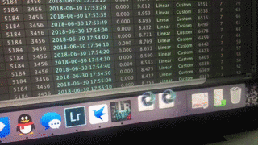

# 广州塔日转夜延时摄影

今天是休息日，在连续好几周忙碌的工作后，终于有时间停下来做一些自己感兴趣的事情了，比如撸猫，跑步或是懒在沙发看电视什么什么的。
然而自己之前计划着尝试日落延时的摄影，虽然在此前已经做足了功课，反复看过好几个日转夜的摄影教程（推荐“左手Plus”的这个教程[【摄影技巧】「日转夜」延时摄影教程](https://www.bilibili.com/video/av7141283)，整个教程满满都是干货），但是一直没提上日程。
今天尝试了拍摄，花了两个小时的拍摄时间，最后浓缩成15秒的延时视频。说实话，拍延时需要一颗强大的耐心，特别是后期，很费时间。但好在小有收获，总结了一些经验，如有不正确的地方，欢迎斧正：

bilibili地址：https://player.bilibili.com/player.html?aid=25997248&cid=44539930&page=1

#### 1.天气要nice，夜景要好看。

今天选择了在广州猎德大桥，传说中的摄影圣地，看了iPhone天气上的日落时间是`19:14`，我至少需要提前一个小时就开始拍摄，这样才能得到明显的日转夜的延时效果，还需要预留半个小时去确定机位，架设三脚架等等工作。

#### 2.准备三脚架

这个不用说了，夜景不上三脚架，还是肥家看电视吧，另外记得关闭相机内置的防抖功能。后期如果还是遇到照片抖动问题（受到风力其他外力影响），还是可以用LightRoom处理抖动问题。

#### 3.关闭自动白平衡

选择固定白平衡，避免光线影响相机的白平衡的选择。

#### 4.关闭自动对焦

不然相机会反复对焦，我们在拍摄前自己手动对焦好就OK了。

#### 5.避免强光源

比如大荧幕闪烁，虽然后期可以用LRTimelapse的`Visual Deflicker`去闪，但处理能力也是有限。

#### 6.如何省电？

关闭图像预览，或者准备备用电池，也可以上淘宝买假电池配合移动电源。

#### 7.时间间隔

一般选择10s一张就差不多了，有一些相机没有内置间隔拍摄的话，需要买快门线，淘宝几十块就买到了。

#### 8.内存需要多大

假设拍摄时间为90分钟，每10秒一张，那么会拍540张，一张RAW格式的照片20M，那么需要10G+的内存。建议直接买64G的内存，也不贵，狗东100多块。

#### 9.选择M档还是A档

教程说是选A档，这样照片的曝光会随时间变化。但是我在入夜后，我遇到燥点过多的情况，还需要研究。也有人说应该用M档。

#### 10.选择RAW格式

后期可以通过LightRoom修图。

#### 11.其他

带上🍞和饮料~哈哈哈，蹲坑时间太长肚子饿咋整。

### 关于后期

主要用到了三个软件：`LRTimelapse`（去闪烁）、`LightRoom`（修图）、`Premiere`（合成视频和加BGM）。

具体如何使用，我现在也是一知半解，都我研究透了再补上专门的教程。还有这几个软件用起来有点烧电脑~心塞，差点把我的MAC卡出翔了。